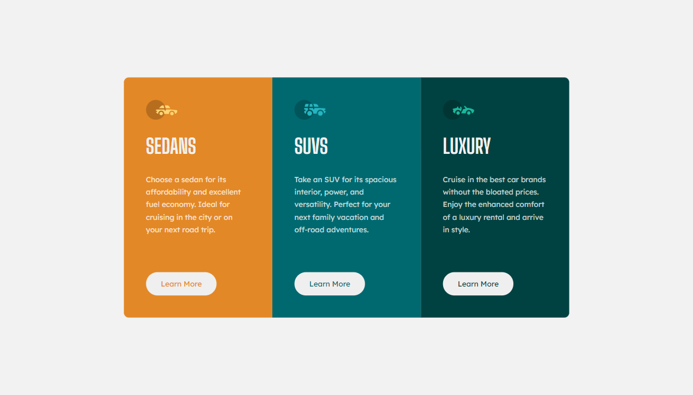
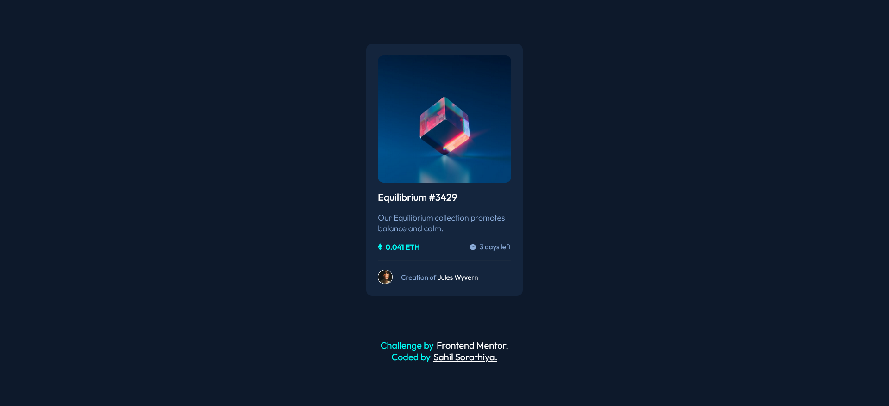
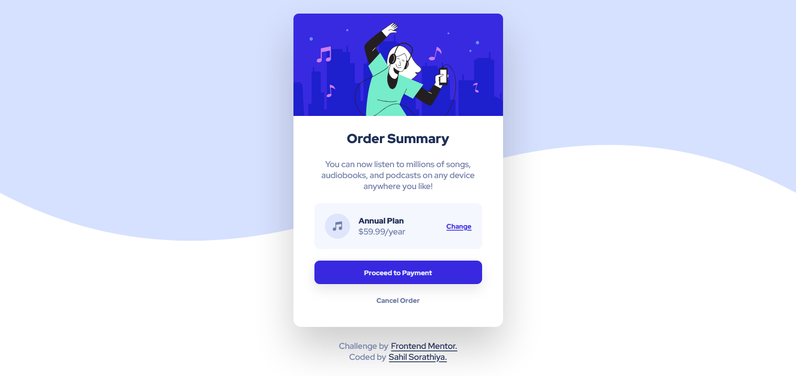

# Frontend Mentor Challanges

## Challenge 1: 3-column preview card solution

This is a solution to the [3-column preview card component challenge on Frontend Mentor](https://www.frontendmentor.io/challenges/3column-preview-card-component-pH92eAR2-). Frontend Mentor challenges help you improve your coding skills by building realistic projects. 

### Overview

#### The challenge

Users should be able to:

- View the optimal layout depending on their device's screen size
- See hover states for interactive elements

#### Screenshot

#### Links

- [Live Site URL](https://sharp-poitras-b3141c.netlify.app/)
- [Frontend Mentor Solution URL](https://www.frontendmentor.io/solutions/3-coloumn-preview-card-tOf5Kaj2Y)

## Challenge 2: NFT preview card component solution

This is a solution to the [NFT preview card component challenge on Frontend Mentor](https://www.frontendmentor.io/challenges/nft-preview-card-component-SbdUL_w0U). Frontend Mentor challenges help you improve your coding skills by building realistic projects. 

### The challenge

Users should be able to:

- View the optimal layout depending on their device's screen size
- See hover states for interactive elements

### Screenshot

### Links

- [Live Site URL](https://stoic-beaver-0d76cb.netlify.app/)
- [Frontend Mentor Solution URL](https://www.frontendmentor.io/solutions/simple-card-using-basic-css-and-flexbox-O3Adho5Jo)

## Challenge 3: Order summary card solution

This is a solution to the [Order summary card challenge on Frontend Mentor](https://www.frontendmentor.io/challenges/order-summary-component-QlPmajDUj). Frontend Mentor challenges help you improve your coding skills by building realistic projects. 

### The challenge

Users should be able to:

- See hover states for interactive elements

### Screenshot

### Links

- [Live Site URL](https://goofy-franklin-c3f2da.netlify.app/)
- [Frontend Mentor Solution URL](https://www.frontendmentor.io/solutions/order-summery-responsive-component-YroLgmB1z)

## Challenge 4: Profile card component solution

This is a solution to the [Profile card component challenge on Frontend Mentor](https://www.frontendmentor.io/challenges/profile-card-component-cfArpWshJ). Frontend Mentor challenges help you improve your coding skills by building realistic projects. 

## Overview

### The challenge

- Build out the project to the designs provided

### Screenshot

### Links

- [Live Site URL](https://youthful-carson-bf93b6.netlify.app/)
- [Frontend Mentor Solution URL](https://www.frontendmentor.io/solutions/profile-card-component-CuBwojOLa)

## Chalenge 5: Stats preview card solution

This is a solution to the [Design preview for the Stats preview card component coding challenge](https://www.frontendmentor.io/challenges/stats-preview-card-component-8JqbgoU62). Frontend Mentor challenges help you improve your coding skills by building realistic projects. 

### The challenge

Users should be able to:

- View the optimal layout depending on their device's screen size

### Screenshot

### Links

- [Solution](https://www.frontendmentor.io/solutions/responsive-stats-preview-card-component-YXbloDRT2)
- [Live Site](https://upbeat-aryabhata-a99247.netlify.app/)

